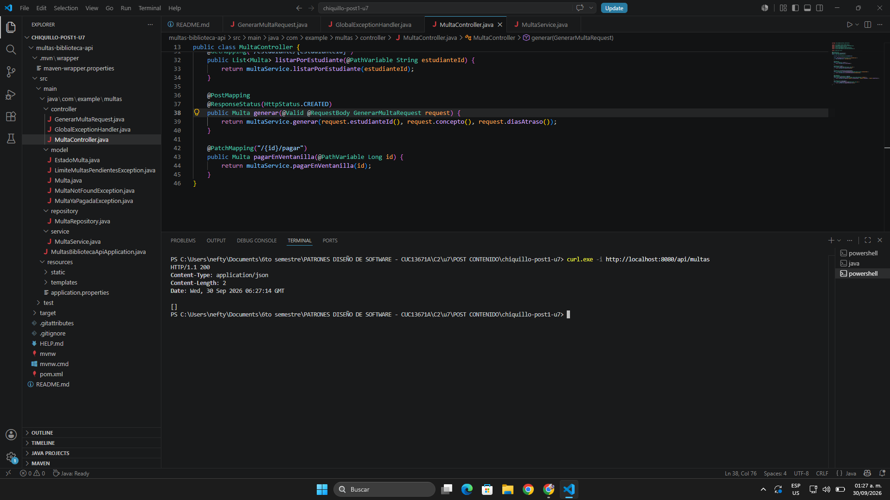
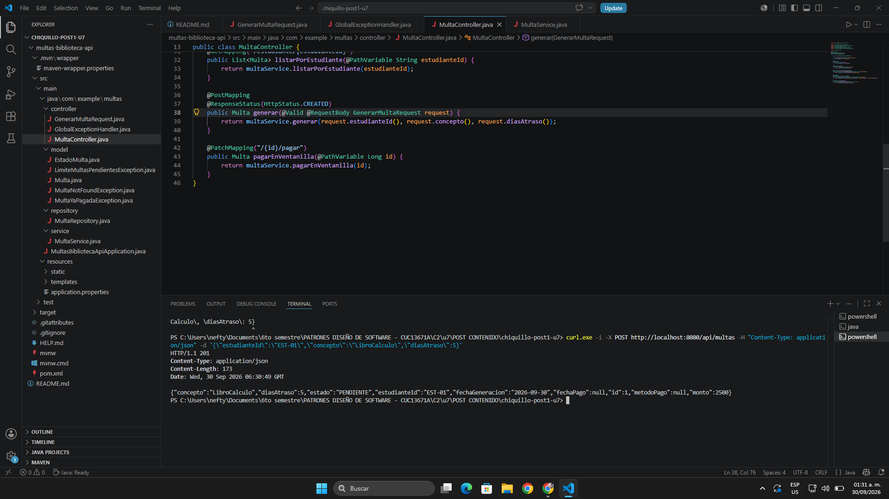
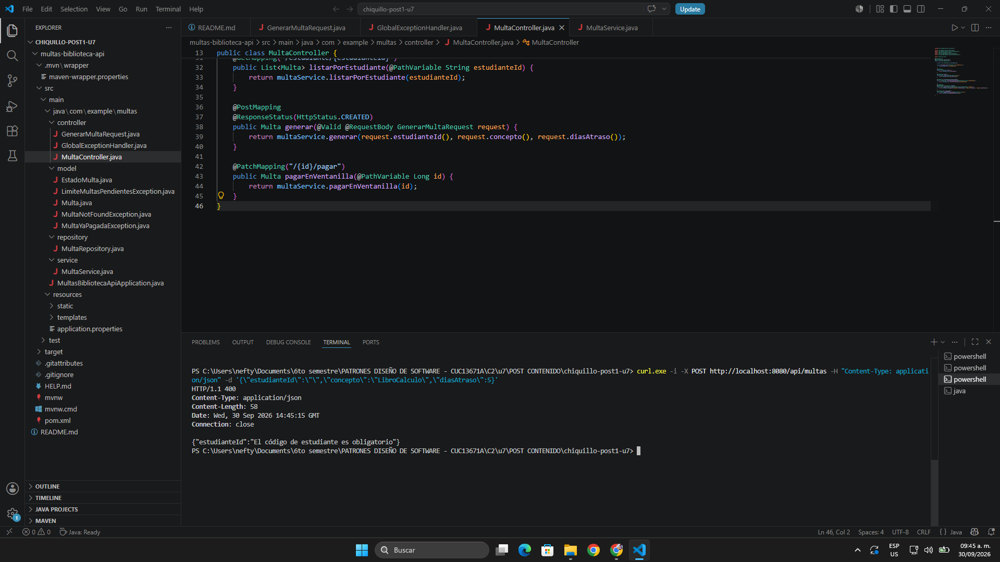
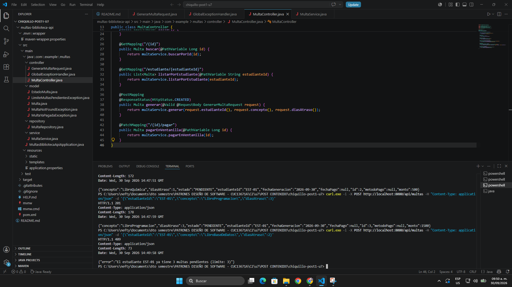
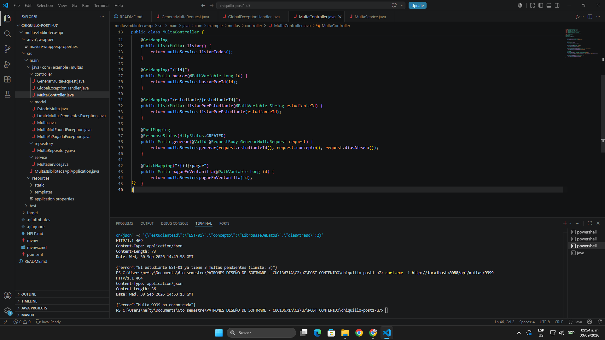
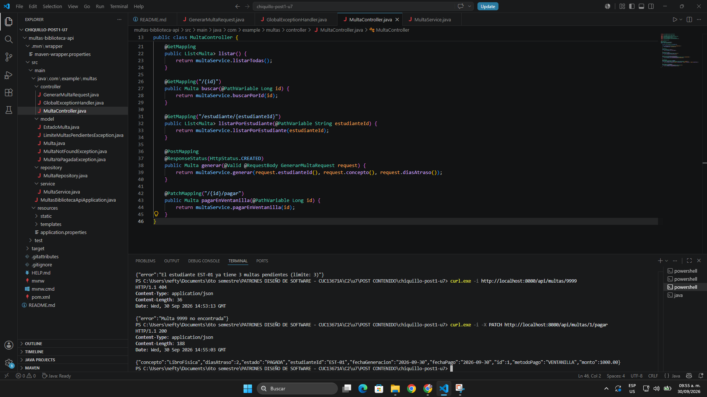
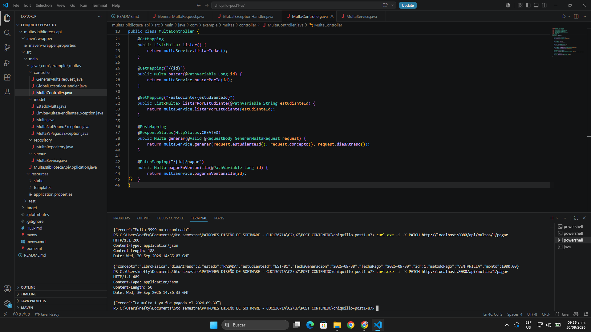

# Post-contenido — Unidad 7: Patrones Arquitectónicos I

## Descripción

Repositorio del post-contenido de la Unidad 7 de Patrones de Diseño de Software. Contiene un único proyecto Spring Boot (`multas-biblioteca-api`) que implementa el backend de un sistema de gestión de multas de biblioteca universitaria sobre una base de datos H2 en memoria.

La biblioteca registra una multa cuando un estudiante devuelve un libro con retraso: el sistema calcula automáticamente el monto a pagar aplicando un tope institucional, impide que un estudiante acumule más de 3 multas pendientes y permite marcar una multa como pagada en ventanilla.

---

## Parte 1 — Arquitectura en Capas

El proyecto está organizado en cuatro capas con responsabilidades claramente delimitadas y un flujo de dependencias **descendente y unidireccional**: cada capa solo conoce a la capa inmediatamente inferior y ninguna capa inferior conoce a las superiores.

| Capa | Paquete | Componentes | Responsabilidad |
|------|---------|-------------|-----------------|
| **Presentación** | `controller/` | `MultaController`, `GenerarMultaRequest`, `GlobalExceptionHandler` | Expone los endpoints REST bajo `/api/multas`, valida la entrada con Bean Validation (`@Valid`) y traduce las excepciones de negocio a códigos HTTP (400, 404, 409) con `@RestControllerAdvice`. No contiene lógica de negocio ni accede al repositorio. |
| **Aplicación** | `service/` | `MultaService` (`@Service`, `@Transactional`) | Orquesta los casos de uso (listar, buscar, generar, pagar en ventanilla), gestiona las transacciones y aplica la política institucional de máximo 3 multas pendientes por estudiante. No conoce nada de HTTP. |
| **Dominio** | `model/` | `Multa`, `EstadoMulta`, `MultaNotFoundException`, `LimiteMultasPendientesException`, `MultaYaPagadaException` | Representa el negocio y sus invariantes. La entidad `Multa` tiene comportamiento propio: calcula su monto (`calcularMonto`) y controla su transición de estado a `PAGADA` (`marcarComoPagada`). |
| **Infraestructura / Persistencia** | `repository/` | `MultaRepository` (extiende `JpaRepository`) | Persiste y recupera multas en H2. Agrega la consulta derivada `countByEstudianteIdAndEstado` para resolver el conteo de multas pendientes directamente en la base de datos. |

**Flujo de dependencias:**

```text
MultaController  ──►  MultaService  ──►  MultaRepository
 (Presentación)       (Aplicación)       (Persistencia)
        │                   │                   │
        └───────────────────┴───────────────────┴──►  model/ (Multa, EstadoMulta, excepciones)
```

- `MultaController` depende únicamente de `MultaService`; **nunca** llama a `MultaRepository` directamente.
- `MultaService` depende de `MultaRepository` y del modelo, pero no importa ninguna clase HTTP (`HttpServletRequest`, `ResponseEntity`, etc.).
- `model/` no depende de ninguna otra capa del proyecto.

**Reglas de negocio:**

1. **Tope de multas pendientes:** antes de generar una multa, `MultaService.generar` consulta cuántas multas `PENDIENTE` tiene el estudiante y lanza `LimiteMultasPendientesException` (409) si ya tiene 3 o más.
2. **Cálculo del monto:** `diasAtraso × $500`, con un tope máximo de `$15.000`, calculado por `Multa.calcularMonto(diasAtraso)`.
3. **Pago único:** `Multa.marcarComoPagada` lanza `MultaYaPagadaException` (409) si la multa ya estaba pagada, y registra la fecha y el método de pago.

### Estructura de paquetes

```text
chiquillo-post1-u7/
├── README.md
├── screenshots/
│   └── p1/                                   ← Evidencias de los endpoints (Parte 1)
└── multas-biblioteca-api/
    ├── pom.xml
    ├── mvnw / mvnw.cmd
    └── src/
        ├── main/
        │   ├── java/com/example/multas/
        │   │   ├── MultasBibliotecaApiApplication.java
        │   │   ├── controller/               ← Capa de Presentación
        │   │   │   ├── GenerarMultaRequest.java
        │   │   │   ├── GlobalExceptionHandler.java
        │   │   │   └── MultaController.java
        │   │   ├── service/                  ← Capa de Aplicación
        │   │   │   └── MultaService.java
        │   │   ├── model/                    ← Capa de Dominio
        │   │   │   ├── EstadoMulta.java
        │   │   │   ├── Multa.java
        │   │   │   ├── MultaNotFoundException.java
        │   │   │   ├── LimiteMultasPendientesException.java
        │   │   │   └── MultaYaPagadaException.java
        │   │   └── repository/               ← Capa de Infraestructura / Persistencia
        │   │       └── MultaRepository.java
        │   └── resources/
        │       └── application.properties
        └── test/
```

## Cómo ejecutar

### Prerrequisitos

- Java JDK 17 o superior
- Apache Maven 3.8+ (o el wrapper `mvnw` incluido en el proyecto)

### Pasos

```bash
# 1. Ubicarse en la carpeta del proyecto
cd multas-biblioteca-api

# 2. Compilar y empaquetar
mvn clean package

# 3. Ejecutar la aplicación
mvn spring-boot:run
```

> En Windows (CMD / PowerShell) con el wrapper: `.\mvnw.cmd clean package` y luego `.\mvnw.cmd spring-boot:run`.

- API disponible en: `http://localhost:8080/api/multas`
- Consola H2: `http://localhost:8080/h2-console`
  - JDBC URL: `jdbc:h2:mem:multas_biblioteca_db`
  - Usuario: `sa` — Contraseña: *(vacía)*

---

## Herramientas utilizadas

- Java 17, Spring Boot 3.x (Spring Web, Spring Data JPA, Validation)
- Hibernate (JPA) y Jakarta Bean Validation (Hibernate Validator)
- H2 Database (en memoria)
- Apache Maven
- Postman / cURL
- Git y GitHub

---

## Decisiones de diseño

### Punto de decisión 1 — Cálculo del monto: ¿entidad o Service?

**Decisión tomada:** la regla de cálculo del monto (`diasAtraso × 500`, con tope de `15.000`) se implementó como el método estático `Multa.calcularMonto(int diasAtraso)` dentro de la propia entidad `Multa`, y `MultaService.generar` lo invoca al construir la multa.

**Alternativa descartada:** un método privado dentro de `MultaService` (por ejemplo `private BigDecimal calcularMonto(int dias)`).

**Criterio usado para decidir "entidad" frente a "Service":** si una regla **no necesita ningún colaborador externo** (Repository, otro Service, transacción, bean de Spring) y solo depende de datos que ya tiene o recibe el propio objeto, es una regla de dominio y vive en la entidad. Si la regla necesita consultar datos que solo conoce la base de datos u orquestar varios componentes, vive en el Service. El cálculo del monto cumple el primer caso: depende exclusivamente del parámetro `diasAtraso` y de dos constantes del negocio (`VALOR_POR_DIA` y `TOPE_MAXIMO`).

**Justificación técnica:**

1. **Evita el modelo de dominio anémico.** Si el cálculo viviera en el Service, `Multa` quedaría reducida a un contenedor de datos con getters y setters, sin ningún comportamiento propio. Al ubicarlo en la entidad, `Multa` describe cómo se comporta una multa (cuánto cuesta y cómo pasa a `PAGADA` con `marcarComoPagada`), mientras que `MultaService` describe cómo se orquesta el caso de uso.
2. **Una sola fuente de verdad para la fórmula.** Cualquier otro punto del sistema que necesite calcular o proyectar el monto (un reporte, una simulación, un futuro caso de uso) usa `Multa.calcularMonto` sin duplicar la fórmula y sin tener que pasar por `MultaService`, que no aporta nada a un cálculo que no requiere dependencias.
3. **Facilidad de prueba.** Al no depender de Spring ni del repositorio, la regla se prueba con un test unitario simple (`Multa.calcularMonto(40)` debe devolver `15000`), sin levantar el contexto de Spring ni una base de datos.

**Qué se pierde con la alternativa:** la regla quedaría escondida en un método privado del Service, imposible de reutilizar sin duplicarla; la entidad perdería su comportamiento, y un cambio en la política de cobro obligaría a buscar la fórmula en la capa de aplicación en vez de en el objeto que representa la multa.

### Punto de decisión 2 — Conteo de multas pendientes: ¿consulta o filtrado en memoria?

**Decisión tomada:** el conteo se resuelve en la base de datos con la consulta derivada `MultaRepository.countByEstudianteIdAndEstado(estudianteId, EstadoMulta.PENDIENTE)`, que devuelve un único número. La decisión de negocio la toma `MultaService.generar`: si el estudiante ya tiene `LIMITE_MULTAS_PENDIENTES` (3) o más, lanza `LimiteMultasPendientesException` (409).

> **Nota de implementación:** la comparación se hace con `pendientes >= LIMITE_MULTAS_PENDIENTES`. Con `>` el sistema permitiría crear una cuarta multa (3 > 3 es falso), incumpliendo el checkpoint que exige un `409 Conflict` al intentar generar la cuarta multa pendiente.

**Alternativa descartada:** traer todas las multas del estudiante con `findByEstudianteId` y filtrarlas en memoria con streams (`filter(m -> m.getEstado() == EstadoMulta.PENDIENTE).count()`).

**Justificación técnica:**

1. **Solo viaja el dato que se necesita.** Spring Data JPA traduce la firma del método a `SELECT COUNT(*) FROM multas WHERE estudiante_id = ? AND estado = ?`. La base de datos devuelve un `long`, en vez de transferir todas las filas del historial del estudiante y que Hibernate construya un objeto `Multa` por cada una solo para contarlas.
2. **Escala con el historial del estudiante.** Con pocos datos de prueba ambas opciones parecen iguales, pero si un estudiante acumula cientos o miles de multas a lo largo de la carrera, la alternativa en memoria cargaría todas en el heap en **cada** creación de multa, y el tiempo de respuesta crecería proporcionalmente al tamaño de su historial. Con el `COUNT` el trabajo de agregación queda en el motor relacional, que está optimizado para eso (y que, si el volumen lo exigiera, podría apoyarse en un índice sobre `estudiante_id` y `estado` sin cambiar una sola línea del Service).
3. **Separación de responsabilidades clara.** El repositorio responde "¿cuántas multas pendientes tiene?" (acceso a datos) y `MultaService` decide "¿se le permite generar una más?" (regla de negocio). El límite de 3 no está en la consulta ni en el controlador: vive solo en el Service, que es donde la guía ubica la lógica de negocio.

**Qué pasaría si la consulta creciera:** con la alternativa en memoria, cada `POST /api/multas` se volvería más lento a medida que crece el historial del estudiante, con mayor consumo de memoria y de transferencia entre la base de datos y la aplicación. Con la consulta agregada, el costo para la aplicación se mantiene constante: siempre recibe un solo número.

---

### Evidencias de pruebas — Parte 1

1. **`GET /api/multas` (estado inicial):** retorna `200 OK` con un arreglo vacío `[]`.

   

2. **`POST /api/multas` (creación exitosa):** con datos válidos retorna `201 Created` y la multa con el monto calculado automáticamente.

   

3. **`POST /api/multas` (validación de campos):** sin `estudianteId`, Bean Validation rechaza la petición y `GlobalExceptionHandler` responde `400 Bad Request` con el mensaje del campo.

   

4. **`POST /api/multas` (límite superado):** al intentar generar una cuarta multa pendiente para el mismo estudiante retorna `409 Conflict`.

   

5. **`GET /api/multas/{id}` (no encontrada):** con un ID inexistente retorna `404 Not Found`.

   

6. **`PATCH /api/multas/{id}/pagar` (pago en ventanilla):** cambia el estado a `PAGADA`, registra `metodoPago: "VENTANILLA"` y la fecha de pago; retorna `200 OK`.

   

7. **`PATCH /api/multas/{id}/pagar` (multa ya pagada):** repetir el pago sobre la misma multa retorna `409 Conflict`.

   

---

## Conclusiones

La Parte 1 mostró que la arquitectura en capas es suficiente y adecuada para un sistema de este tamaño: separar `controller/`, `service/`, `model/` y `repository/` permitió que cada clase tuviera una sola razón para cambiar y que el controlador nunca tocara la persistencia. El aprendizaje más importante fue que "estar en capas" no significa que toda la lógica deba ir en el Service: la pregunta útil es qué necesita cada regla para ejecutarse. El cálculo del monto no necesita colaboradores, por eso vive en la entidad y evita un modelo anémico; el tope de multas pendientes sí necesita datos de la base, por eso el Service toma la decisión apoyándose en una consulta agregada del repositorio. Finalmente, centralizar las excepciones en `GlobalExceptionHandler` hizo que las reglas de negocio se tradujeran de forma consistente a códigos HTTP (400, 404, 409) sin mezclar HTTP con la lógica del dominio.