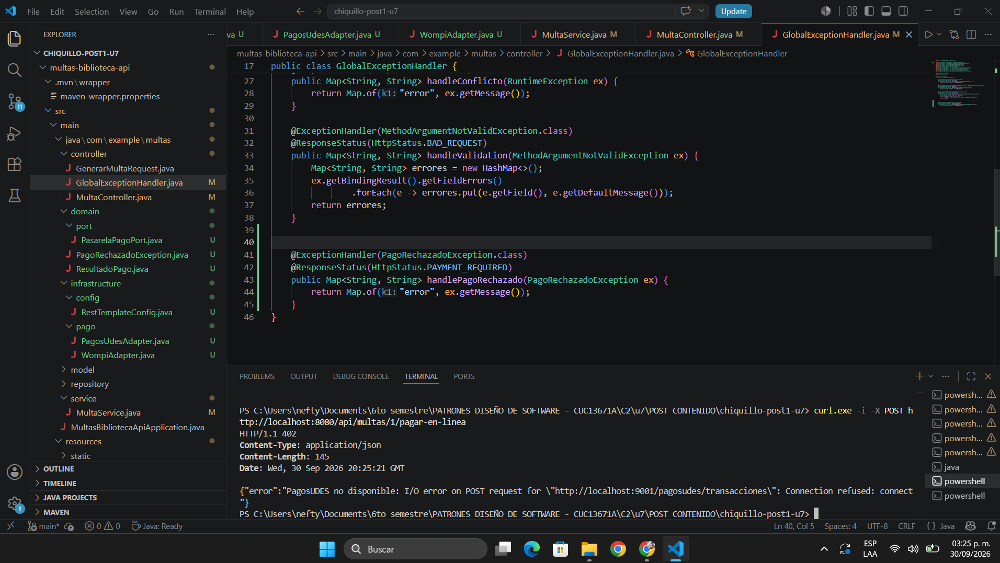
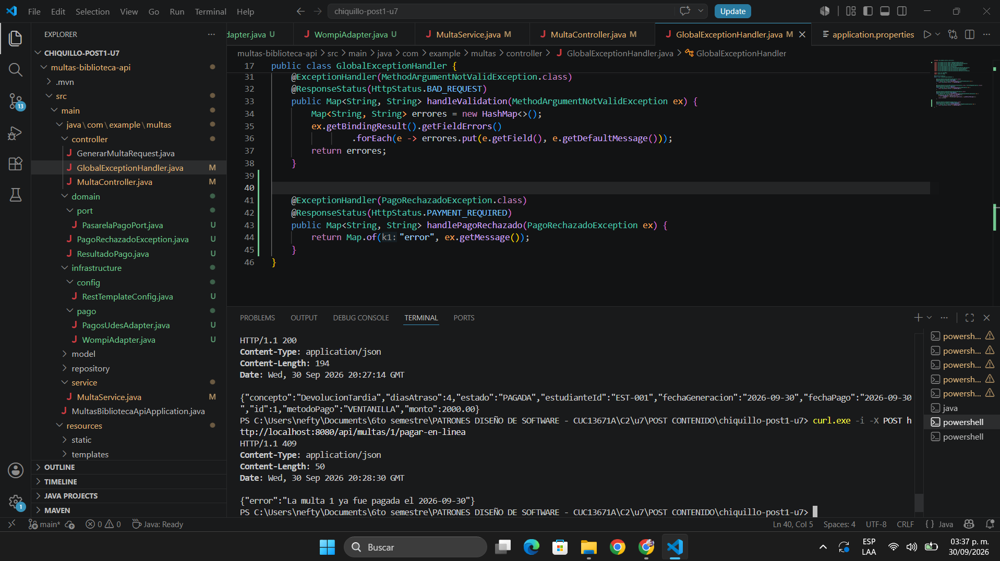
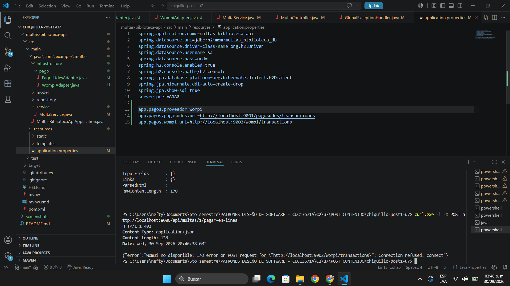
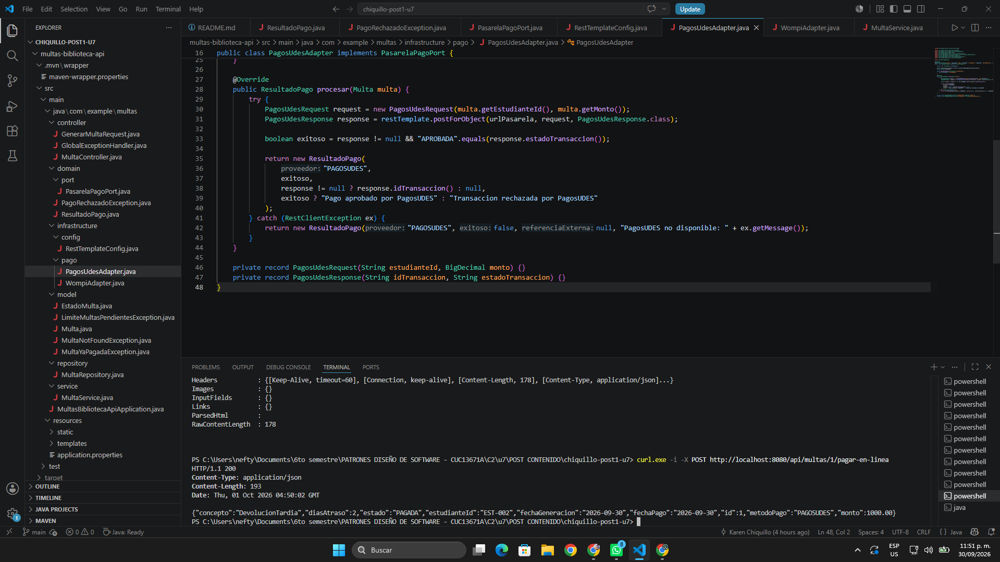

# Post-contenido — Unidad 7: Patrones Arquitectónicos I

## Descripción

Repositorio del post-contenido de la Unidad 7 de Patrones de Diseño de Software. Contiene un único proyecto Spring Boot (`multas-biblioteca-api`) para la gestión de multas de biblioteca universitaria sobre una base de datos H2 en memoria: la biblioteca registra una multa cuando un estudiante devuelve un libro con retraso, el sistema calcula su monto y permite marcarla como pagada.

El proyecto tiene dos partes: la **Parte 1** implementa una API REST con arquitectura en capas (Model, Repository, Service, Controller) para generar multas y pagarlas en ventanilla; la **Parte 2** agrega el pago en línea con dos pasarelas intercambiables por configuración (PagosUDES y Wompi).

---

## Parte 1 — Arquitectura en Capas

El sistema se organiza en cuatro capas con dependencias descendentes y unidireccionales (`controller/` → `service/` → `repository/`, y todas usan `model/`). Ninguna capa inferior conoce a las superiores y el controlador nunca accede al repositorio directamente.

| Capa | Paquete | Responsabilidad |
|------|---------|-----------------|
| Presentación | `controller/` | `MultaController` expone `/api/multas`; `GenerarMultaRequest` valida la entrada con Bean Validation (`@Valid`); `GlobalExceptionHandler` traduce las excepciones de negocio a 400, 404 y 409. Sin lógica de negocio. |
| Aplicación | `service/` | `MultaService` (`@Transactional`) orquesta los casos de uso y aplica la regla de máximo 3 multas pendientes por estudiante. No conoce HTTP. |
| Dominio | `model/` | La entidad `Multa` tiene comportamiento propio: calcula su monto (`Multa.calcularMonto`) y controla su paso a `PAGADA` (`marcarComoPagada`). Incluye `EstadoMulta` y las excepciones de negocio. |
| Persistencia | `repository/` | `MultaRepository` extiende `JpaRepository` y agrega la consulta agregada `countByEstudianteIdAndEstado`. |

`MultaService` no es un *passthrough* del repositorio: antes de guardar aplica el tope de multas pendientes (`pendientes >= 3` → `LimiteMultasPendientesException`) y asigna el monto calculado por la entidad (`500` por día de atraso, con tope de `15.000`).

| Método | Ruta | Respuestas |
|--------|------|------------|
| `GET` | `/api/multas` | 200 |
| `GET` | `/api/multas/{id}` | 200 / 404 |
| `GET` | `/api/multas/estudiante/{estudianteId}` | 200 |
| `POST` | `/api/multas` | 201 / 400 / 409 |
| `PATCH` | `/api/multas/{id}/pagar` | 200 / 404 / 409 |

---

## Parte 2 — Pago en Línea con Dos Pasarelas

**Requisito:** además del pago en ventanilla, se debe permitir el pago en línea con dos pasarelas que conviven durante un piloto, cada una con un contrato HTTP distinto: PagosUDES (responde `idTransaccion`/`estadoTransaccion`) y Wompi (trabaja en centavos y responde `reference`/`status`). Cada sede configura su pasarela, y el cambio no debe obligar a recompilar `MultaController` ni `MultaService`.

**Opción elegida: C — puerto de dominio con dos adaptadores** (hexagonal solo en la porción de pago). Las opciones A (`if/switch` en `MultaService`) y B (interfaz Strategy dentro de `service/`) se descartaron; la comparación está en *Trade-off considerado*.

**Por qué:** la guía de la unidad (sección 7.3) recomienda hexagonal cuando el sistema debe soportar varias fuentes externas, porque un puerto de salida admite varias implementaciones. Cada pasarela es una fuente externa con su propio formato, y con el puerto ese formato se traduce en el borde del sistema sin llegar al Service. El resto del proyecto (`Multa`, `MultaRepository`, `MultaController`) se mantiene en capas, porque migrarlo a hexagonal sería sobreingeniería.

**Implementación:**

- `domain/port/PasarelaPagoPort` y `domain/ResultadoPago` son Java puro: no importan Spring, `RestTemplate` ni clases de ninguna pasarela. `domain/PagoRechazadoException` representa un pago no aprobado.
- `infrastructure/pago/PagosUdesAdapter` e `infrastructure/pago/WompiAdapter` implementan el puerto, llaman a su pasarela con `RestTemplate` y traducen su respuesta al mismo `ResultadoPago`. Sus DTOs son `record` privados dentro de cada adaptador, y `WompiAdapter` convierte el monto a centavos.
- El adaptador activo se elige con `app.pagos.proveedor` (`pagosudes` por defecto, o `wompi`) sin tocar `MultaController` ni el resto de `MultaService`.
- `MultaService.pagarConPasarela` recibe el puerto por constructor; `MultaController` expone `POST /api/multas/{id}/pagar-en-linea`, y `GlobalExceptionHandler` responde **402** si el pago es rechazado y **409** si la multa ya estaba pagada.

### Estructura de paquetes final

```text
chiquillo-post1-u7/
├── README.md
├── screenshots/
│   ├── p1/                         ← Evidencias Parte 1
│   └── p2/                         ← Evidencias Parte 2
└── multas-biblioteca-api/
    ├── pom.xml
    ├── mvnw / mvnw.cmd
    └── src/main/
        ├── java/com/example/multas/
        │   ├── controller/         ← Presentación (Controladores REST y excepciones)
        │   │   ├── GenerarMultaRequest.java
        │   │   ├── GlobalExceptionHandler.java
        │   │   └── MultaController.java
        │   ├── domain/             ← Puerto y contratos en Java puro
        │   │   ├── port/
        │   │   │   └── PasarelaPagoPort.java
        │   │   ├── PagoRechazadoException.java
        │   │   └── ResultadoPago.java
        │   ├── infrastructure/     ← Adaptadores (Integración HTTP y configuración)
        │   │   ├── config/
        │   │   │   └── RestTemplateConfig.java
        │   │   └── pago/
        │   │       ├── PagosUdesAdapter.java
        │   │       └── WompiAdapter.java
        │   ├── model/              ← Dominio JPA (Entidades y excepciones de negocio)
        │   │   ├── EstadoMulta.java
        │   │   ├── LimiteMultasPendientesException.java
        │   │   ├── Multa.java
        │   │   ├── MultaNotFoundException.java
        │   │   └── MultaYaPagadaException.java
        │   ├── repository/         ← Persistencia (Acceso a base de datos)
        │   │   └── MultaRepository.java
        │   ├── service/            ← Aplicación (Orquestación y reglas de negocio)
        │   │   └── MultaService.java
        │   └── MultasBibliotecaApiApplication.java
        └── resources/
            └── application.properties
```

---

## Cómo ejecutar

Requisitos: Java 17 o superior y Maven 3.8+ (o el wrapper incluido).

```bash
cd multas-biblioteca-api
mvn clean package
mvn spring-boot:run
```

> En Windows con el wrapper: `.\mvnw.cmd clean package` y `.\mvnw.cmd spring-boot:run`.

- API: `http://localhost:8080/api/multas`
- Consola H2: `http://localhost:8080/h2-console` (JDBC URL `jdbc:h2:mem:multas_biblioteca_db`, usuario `sa`, sin contraseña)
- Para cambiar de pasarela, editar `application.properties` y reiniciar:

```properties
app.pagos.proveedor=pagosudes   # o wompi
app.pagos.pagosudes.url=http://localhost:9001/pagosudes/transacciones
app.pagos.wompi.url=http://localhost:9002/wompi/transactions
```

---

## Herramientas utilizadas

- Java 17, Spring Boot 4.1.1 (Spring Web MVC, Spring Data JPA, Validation), H2, RestTemplate
- Apache Maven, cURL, Git, GitHub

## Decisiones de diseño

### Punto de decisión 1 — Cálculo del monto: ¿entidad o Service?

**Decisión:** el cálculo (`diasAtraso × 500`, con tope de `15.000`) vive en el método estático `Multa.calcularMonto(int diasAtraso)`, y `MultaService.generar` lo invoca. **Alternativa descartada:** un método privado en `MultaService`.

**Criterio:** una regla va en la entidad si no necesita colaboradores externos (Repository, otro Service, beans de Spring), y va en el Service si necesita datos de la base o coordinar componentes. El cálculo del monto solo depende del parámetro `diasAtraso` y de dos constantes, así que pertenece a `Multa`.

**Justificación:** (1) evita el *modelo de dominio anémico*, porque `Multa` deja de ser solo datos con getters y setters y tiene su propio comportamiento (`calcularMonto`, `marcarComoPagada`); (2) la fórmula queda en un solo lugar y cualquier otro caso de uso puede reutilizarla sin duplicarla ni pasar por el Service; (3) se prueba con un test unitario puro (`calcularMonto(40)` debe devolver `15000`) sin levantar Spring ni la base de datos. Con la alternativa, la fórmula quedaría escondida en un método privado del Service y la entidad perdería su comportamiento.

### Punto de decisión 2 — Conteo de multas pendientes: ¿consulta o filtrado en memoria?

**Decisión:** el conteo se resuelve en la base de datos con `MultaRepository.countByEstudianteIdAndEstado(estudianteId, EstadoMulta.PENDIENTE)`, y `MultaService.generar` decide con `pendientes >= LIMITE_MULTAS_PENDIENTES`. **Alternativa descartada:** traer todas las multas con `findByEstudianteId` y contarlas con streams.

**Justificación:** (1) Spring Data JPA traduce el método a un `SELECT COUNT(*) ... WHERE estudiante_id = ? AND estado = ?`, que devuelve un solo número en lugar de transferir y convertir en objetos todo el historial del estudiante; (2) si un estudiante acumulara cientos o miles de multas, la alternativa en memoria haría cada creación de multa más lenta y pesada en proporción a su historial, mientras que con la consulta agregada la aplicación siempre recibe un único valor; (3) separa responsabilidades: el repositorio resuelve el dato ("¿cuántas tiene?") y el Service toma la decisión de negocio ("¿puede generar otra?").

### Punto de decisión 3 — Selección del adaptador activo

**Decisión:** cada adaptador lleva `@ConditionalOnProperty(prefix = "app.pagos", name = "proveedor", havingValue = ...)`, así que al arrancar Spring crea **un solo bean** de `PasarelaPagoPort` (PagosUDES por defecto con `matchIfMissing = true`). `MultaService` lo recibe por constructor, sin `@Qualifier` ni condicionales. **Alternativa descartada:** inyectar un `Map<String, PasarelaPagoPort>` y elegir el proveedor en tiempo de ejecución.

**Justificación:** el requisito real es una pasarela fija por sede durante el piloto, definida al desplegar, no una elección en cada pago. Un único bean cubre exactamente eso, y `MultaService` no tiene que conocer las claves de configuración de cada proveedor (`"pagosudes"`, `"wompi"`). **Lo que se sacrifica:** con el `Map` se podría cambiar de pasarela sin reiniciar o usar ambas a la vez; con la opción elegida el cambio exige reiniciar la aplicación, algo aceptable para el requisito actual.

### Punto de decisión 4 — Diseño del puerto y el tipo de resultado

**Decisión:** `PasarelaPagoPort.procesar(Multa)` devuelve el tipo neutral `ResultadoPago(proveedor, exitoso, referenciaExterna, mensaje)`, y cada adaptador traduce su respuesta a ese tipo. **Alternativa descartada:** que el puerto devolviera el DTO propio de cada pasarela, o que tuviera un método por proveedor.

**Justificación:** si el puerto devolviera los DTOs de PagosUDES o de Wompi, `MultaService` tendría que conocer y distinguir ambos formatos, y agregar una tercera pasarela obligaría a modificar el Service además de crear el adaptador. Con `ResultadoPago`, un nuevo proveedor solo requiere un adaptador nuevo. Además, si `ResultadoPago` tuviera un campo `idTransaccion` en lugar de `referenciaExterna`, `WompiAdapter` tendría que guardar su `reference` en un campo que describe un concepto de PagosUDES (o inventar un valor), señal de que el tipo de dominio no sería neutral frente a los proveedores.

### Trade-off considerado — Parte 2

Se descartó extender las capas, tanto con la Opción A (`if/switch` en `MultaService`) como con la Opción B (Strategy en `service/`), y se eligió el puerto con adaptadores (Opción C). Contra la opción descartada pesan dos cosas: con A, `MultaService` conocería los detalles HTTP de ambas pasarelas y habría que modificarlo para cada proveedor nuevo; con B se resolvía la intercambiabilidad, pero las clases con `RestTemplate`, URLs y DTOs de cada pasarela quedaban dentro de la capa de aplicación. **Lo que se ganó con C:** (1) los formatos externos se traducen en `infrastructure/` y nunca llegan a `MultaService`, y (2) `ResultadoPago` es un contrato neutral que permite agregar o quitar pasarelas sin tocar el Service ni el Controller. **Lo que costó:** dos paquetes nuevos (`domain/` e `infrastructure/`), seis clases nuevas (unas 128 líneas, sin contar los cambios en Service y Controller), una curva de aprendizaje mayor por la inversión de dependencias, y la disciplina de no importar Spring dentro de `domain/`. También es un aislamiento parcial: el puerto recibe la entidad `Multa`, que tiene anotaciones JPA, algo aceptado porque convertir `Multa` en un modelo puro sería migrar todo el proyecto. **Reversión:** si el piloto terminara y quedara una sola pasarela sin previsión de cambios, el equipo sí consideraría volver a un servicio de pago simple en capas, porque mantener un puerto para un único proveedor fijo sería complejidad innecesaria.

---

## Evidencias de pruebas

### Parte 1

| # | Prueba | Resultado |
|---|--------|-----------|
| 1 | `GET /api/multas` al iniciar | 200, lista vacía |
| 2 | `POST /api/multas` con datos válidos | 201, monto calculado |
| 3 | `POST /api/multas` sin `estudianteId` | 400 |
| 4 | `POST /api/multas` cuarta multa pendiente del mismo estudiante | 409 |
| 5 | `GET /api/multas/{id}` inexistente | 404 |
| 6 | `PATCH /api/multas/{id}/pagar` | 200, `PAGADA` con `metodoPago: "VENTANILLA"` |
| 7 | `PATCH /api/multas/{id}/pagar` sobre multa ya pagada | 409 |


### Parte 2

Las pasarelas reales PagosUDES y Wompi no están disponibles en local. En las pruebas 1 y 3, cada adaptador captura el error de conexión y devuelve un `ResultadoPago` no exitoso, lo que permite verificar el rechazo con 402 y el cambio de proveedor. En la prueba 4 se levantó un simulador de PagosUDES en el puerto 9001 que responde `estadoTransaccion: "APROBADA"`, para verificar un pago procesado correctamente.

| # | Prueba | Resultado |
|---|--------|-----------|
| 1 | `POST /api/multas/{id}/pagar-en-linea` con `app.pagos.proveedor=pagosudes` | 402, mensaje de PagosUDES |
| 2 | `POST /api/multas/{id}/pagar-en-linea` sobre multa ya pagada | 409 |
| 3 | Mismo endpoint tras cambiar solo a `app.pagos.proveedor=wompi` | 402, mensaje de Wompi (sin tocar Controller ni Service) |
| 4 | `POST /api/multas/{id}/pagar-en-linea` con el simulador de PagosUDES activo | 200, `PAGADA` con `metodoPago: "PAGOSUDES"` |






---


## Conclusiones

La Parte 1 mostró que la arquitectura en capas es suficiente para este sistema y que "estar en capas" no significa poner toda la lógica en el Service: el cálculo del monto vive en la entidad porque no necesita colaboradores, y el tope de multas pendientes vive en el Service porque necesita un dato que se resuelve eficientemente con una consulta agregada. La Parte 2 mostró que el puerto con adaptadores aporta valor justo en el borde del sistema, donde las pasarelas externas traen contratos distintos y cambiantes, sin necesidad de convertir todo el proyecto a hexagonal. Lo que más dificultó la decisión fue que la Opción B también cumplía el requisito con menos código, de modo que la elección dependía de prever si los proveedores seguirían cambiando y de cuánto importaba que los formatos HTTP no entraran a la capa de aplicación.